# 🧪 LLMs4SQL 小组项目报告

## 1. 小组信息
- **Siyu Xie (72542207)** 本科专业：食品科学与工程
- **Xinfang Zhang (72542152)** 本科专业：信息管理与信息系统
- **Jingyi Dong (72542072)** 本科专业：大数据管理与应用
- **Wenyue Yang (72542268)** 本科专业：信息管理与信息系统
- **Jingwen Luo (72542176)** 本科专业：信息与计算科学

## 2. 贡献说明
- **Siyu Xie (72542207)**:
    - 大模型云平台接口代码封装
    - `missing_token` 评估结果分析 + 报告
- **Xinfang Zhang (72542152)**:
    - 模型推理代码 pipeline 封装
    - `syntax_error` 评估结果分析 + 报告
- **Jingyi Dong (72542072)**:
    - 论文搜索 + 论文分析
    - `query_performance` 评估结果分析 + 报告
- **Wenyue Yang (72542268)**:
    - 结果评估代码 pipeline 封装
    - `query_equality` 评估结果分析 + 报告
- **Jingwen Luo (72542176)**:
    - 数据预处理代码 + 数据映射代码
    - 报告整合撰写 + 代码仓库整合

> 注：小组成员均进行了**原论文的研读分析+优化创新方案**的设计思考，且在项目过程中进行了**不同模块的代码实现**。

---

## 3. 项目概述
### 3.1 背景 & 动机
近年来大型语言模型（LLMs）在自然语言处理、代码生成等领域表现强劲，但它们是否能“真正理解”结构化查询语言（SQL）仍存在疑问。结构化查询语言对语法、语义、上下文、执行逻辑都有严格要求。原论文提出，通过一系列 SQL-centric 任务全面评估 LLMs 的“理解能力”。

### 3.2 核心论文
- **论文名称**：*Evaluating SQL Understanding in Large Language Models* (https://arxiv.org/abs/2410.10680)
- **作者**：Ananya Rahaman, Anny Zheng, Mostafa Milani, Fei Chiang, Rachel Pottinger (https://arxiv.org/abs/2410.10680)
- **发表/提交时间**：2024 年 10 月 (arXiv)；后为 EDBT 2025 会议录用 (卷 28, pp. 909-921) (https://chatgpt.com/c/6936999c-6c74-8324-b08e-59372426e2c5)

- **研究目标**：
    评估 LLMs 在 SQL 任务上的表现，考察它们在识别 (recognition)、上下文 (context)、语义 (semantics)、连贯性 (coherence) 这四个能力维度上的强弱。论文设计了一系列任务，包括语法错误检测 (syntax error detection)、缺失 token 识别 (missing token identification)、查询性能预测 (query performance prediction)、查询等价性检查 (query equivalence checking)、以及 SQL → 自然语言解释 (query explanation)。

- **主要发现**：
    尽管某些模型（如 GPT‑4）在基础任务（recognition / context）上表现较好，但所有模型在更深层的语义理解与连贯性 (尤其是等价性判断与性能估计) 上仍存在显著不足。也就是说，目前 LLMs 在“真正理解复杂 SQL 语义与逻辑”的能力上仍有明显局限。

### 3.3 复现的动机 & 目标
- **复现动机**：
    1. 原论文虽提供了任务定义与评估思路，但缺乏完整的可复现 pipeline —— prompt 设计、输出解析、评估流程等没有公开。
    2. 实际部署与科研复现中，需要一个结构化、工程化、可扩展的框架，以便不同模型 / 不同 prompt / 不同任务的统一评估。
    3. 通过系统化重构与扩展 (任务维度更细、输出结构化、可自动评估)，构建一个 “可信赖的 SQL 理解能力基准 (benchmark)” —— 对未来研究与系统应用都有现实价值。

- **复现目标**：
    1. 基于论文任务定义，对语法错误检测、缺失 token 识别、查询性能预测、查询等价性分析等任务进行重构扩展。
    2. 设计结构化 prompt + JSON schema 输出 + 稳定 sampling + 统一 LLM server 接口。
    3. 构建 inference pipeline + evaluation pipeline，使评估结果可自动计算 (二分类、多分类、位置预测、F1 / MAE / Hit-Rate 等)。
    4. 支持多种 LLM 的 plug-and-play 测试。
    5. 由于原论文的结果可复现性存疑，本项目只基于原论文的任务定义和数据，自行开发复现 pipeline 进行对比分析，不依赖原论文的实验结果。

---

## 4. 技术设计
### 4.1 论文方法概述
原论文提出了基于 SQL 的五类任务（语法错误检测、缺失 token 识别、查询性能预测、查询等价性检查、查询解释），核心技术思路如下：

1. **任务定义**：每类任务明确输入（SQL 查询）与输出（错误标记、性能类别、等价性标签等）。
2. **评估指标**：主要使用 Precision、Recall、F1-Score 等统计指标，部分任务引入 MAE、Hit Rate 等衡量模型预测的精确性。
3. **Prompt 使用**：论文通过简单自然语言提示指导模型生成答案，但未明确输出结构或 JSON schema，也未统一随机性采样策略。
4. **数据与实验**：数据来源包括 SDSS、SQLShare、Join-Order 和 Spider；实验结果部分经过人工评估，存在复现性与自动化不足问题。

### 4.2 本项目实现策略
针对原论文方法的局限性，本项目设计了完整、可复现的技术实现框架，包括：

1. **数据处理与标准化**
    - 收集与清洗原论文数据集，统一字段、表结构信息。
    - 对查询进行 tokenization、结构化标注，方便后续任务解析与定位。

2. **Prompt Engineering**
    - 设计 zero-shot 与 few-shot prompt，确保模型输出符合 JSON schema，便于自动解析。
    - 引入角色、工作流程约束，引导模型生成连贯、可解析的回答。

3. **Inference Pipeline**
    - 实现 SQL-centric 任务的推理 pipeline，支持不同模型 / 不同 prompt / 不同任务的统一评估。
    - 构建统一 LLM 接口（Doubao / Qwen / Deepseek / GLM 等），支持思考 / 非思考模式。
    - 支持批量推理、随机性控制与可复现采样。

4. **Evaluation Pipeline**
    - 对不同任务进行二分类、多分类、位置预测等评估。
    - 自动计算 Precision / Recall / F1 / MAE / Hit Rate 等指标，生成可视化结果表格与分析报告。

5. **结果分析**
    - 提供任务维度的模型表现分析，发现模型在复杂语义和等价性任务上存在局限。
    - 不与原论文实验结果对比，以确保数据可靠性和实验可复现性。

### 4.3 与论文方法的偏差说明
- 本项目不直接使用论文的人工评估结果，而是通过统一、自动化的 pipeline 重新计算指标。
- 由于原论文未提供具体模型版本、prompt 或采样细节，本项目的实验环境与论文略有差异，因此不与其数值做直接对比。
- 选择以下模型进行实验对比分析：
    - **Doubao-Seed-1.6-251015** ~ 来源：字节跳动最新可控思考模型
    - **qwen3-next-80b-a3b-instruct** ~ 来源：阿里巴巴 / 通义千问 开源系列最新非思考模型，MOE架构
    - **GLM-4.6** ~ 来源：智谱AI最新可控思考模型
    - **DeepSeek-V3.1-Terminus** ~ 来源：深度求索DeepSeek推出的可控思考模型
    - **DeepSeek-V3.1-Terminus (开启推理)** ~ 来源：深度求索DeepSeek推出的可控思考模型
- 输出格式、评估流程、任务划分在本项目中进行了优化，以提高可复现性与工程化水平。

---

## 5. 算法 / 系统实现
### 5.1 核心算法描述
本项目构建了一个**统一的 LLM SQL 理解评估系统**，核心设计如下：

1. **多平台 LLM 接口封装**
    - `LLMServer` 提供统一接口，支持 Doubao、Qwen、SiliconFlow、普通 OpenAI 接口等多平台。
    - 支持 `chat`、`vision chat`、`embedding` 模式，模型是否具有“推理能力”可配置。
    - 后端统一封装 API 请求，保证推理流程可复现。

2. **推理 Pipeline (`Inference` 类)**
    - 输入：SQL 查询 + 任务类型 (`InferType`)
    - 输出：符合 JSON schema 的结构化结果，便于自动化解析。
    - 支持批量处理与多线程推理（`max_workers` 控制并行数量）。
    - 可配置推理策略：是否启用 reasoning / thinking 模式。

3. **评估 Pipeline (`EvaluateTool` 类)**
    - 对不同任务类型进行自动评估，包括二分类、多分类、位置预测等。
    - 指标支持：Precision / Recall / F1 / MAE / Hit Rate。
    - 支持 Macro F1 计算，用于多分类任务的全局表现衡量。
    - 自动加载评估数据，输出可视化结果与分析报告。

4. **配置驱动设计**
    - 使用 YAML 配置文件统一管理模型参数、推理策略、评估任务及数据路径。
    - 支持灵活切换模型和任务，无需修改核心代码。

示例配置 (`infer.yaml`)：
```yaml
model:
  model_type: doubao
  base_url: https://ark.cn-beijing.volces.com/api/v3/
  api_key: api_key
  reasoning_ability: True

inference:
  model_name: model_name
  model_identifier: NULL
  reasoning: False
  max_workers: 10

```
`eval.yaml`：
```yaml
evaluation:
  infer_type: syntax_error
  data_dir: outputs/syntax_error
  model_list: ['DeepSeek-V3.1-Terminus-Thinking', 'GLM-4.6', 'DeepSeek-V3.1-Terminus', 'Doubao-Seed-1.6-251015', 'qwen3-next-80b-a3b-instruct']
```

### 5.2 关键数据结构
- **`Inference` 类**
    - `llms: LLMServer` — LLM 接口对象
    - `infer_type: InferType` — 推理任务类型
    - `model_name / model_identifier` — 模型标识
    - `max_workers` — 并行推理线程数

- **`EvaluateTool` 类**
    - `dataset` — 对应任务的数据集
    - `infer_type` — 评估任务类型
    - `metrics` — 自动计算 Precision / Recall / F1 / MAE / Hit Rate

- **推理输出示例**：
```json
{
  "syntax_error": "YES/NO",
  "syntax_error_type": <type>
}
```

### 5.3 正确性验证方法
- **数据一致性检查**：对输入 SQL 查询与标注数据进行 token / schema 对齐，保证推理输入有效。
- **结果解析校验**：对 JSON 输出进行严格 schema 校验，避免解析错误导致指标偏差。
- **指标对比**：对多分类任务，使用 Macro F1 全局衡量，确保不同模型可直接比较。
- **多模型 & 多任务复测**：使用多线程并行验证，确保推理速度和评估结果的稳定性与可复现性。

---

## 6. 评估与结果
### 6.1 实验设置
- **硬件环境**：Apple Mac M3 Pro，18 核 CPU，36G 内存（集成 / 并行加速）
- **软件环境**：
    - Python 3.10
    - `pandas / numpy / yaml / tqdm /matplotlib` 等数据处理库
    - `openai` 库用于调用模型 API。
    - 自定义 `LLMServer`, `Inference`, `EvaluateTool` 模块

### 6.2 所用数据集
| 数据集 | 来源 | 查询数量 | 描述 |
| :--- | :--- | :--- | :--- |
| SDSS | Sloan Digital Sky Survey (2023) | 285 | 天文查询数据，包含多种表连接、过滤条件和聚合操作。用于语法错误检测、缺失 token 识别、查询性能预测、查询等价性检查。 |
| SQLShare | SQLShare 平台 | 251 | 教育及科研用途 SQL 查询，涵盖不同复杂度，测试 LLM 对多表 join、子查询和聚合函数的理解能力。 |
| Join-Order | Join-Order Benchmark | 157 | 专注于 SQL join 顺序和执行性能的查询集合，主要用于语法检测，缺失 token 与等价性检查。 |

> 数据均经过预处理，包括标准化表名/列名、tokenization、任务标注和 JSON schema 转换，以保证可自动评估。

### 6.3 评估性能指标
针对不同任务类型，采用以下指标进行自动化评估：

| 任务 | 性能指标 | 说明 |
| :--- | :--- | :--- |
| 语法错误检测 (Syntax Error Detection) | Precision / Recall / F1-Score | 二分类 / 多分类性能衡量 |
| 缺失 token 识别 (Missing Token Identification) | Precision / Recall / F1-Score / MAE / Hit Rate | 同时衡量缺失位置的定位准确性 |
| 查询性能预测 (Query Performance Prediction) | Precision / Recall / F1-Score | 对高成本 / 低成本查询分类准确性 |
| 查询等价性检查 (Query Equivalence Checking) | Precision / Recall / F1-Score / Macro F1 | 多分类任务，支持等价类别映射 |
| 查询解释 (Query Explanation) | 定性分析 | 将 SQL 转换为自然语言描述，评估可读性和语义准确性，不作为核心指标 |

> 所有任务均通过统一 pipeline 自动计算指标，确保可复现性和多模型可比性。

### 6.4 实验结果分析
> 不与原论文实验结果对比，以确保数据可靠性和实验可复现性。

#### 6.4.1 数据预处理和可视化
- **SDSS统计量:**
  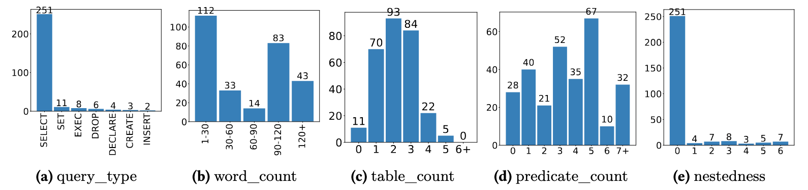
- **SQLSHARE统计量:**
  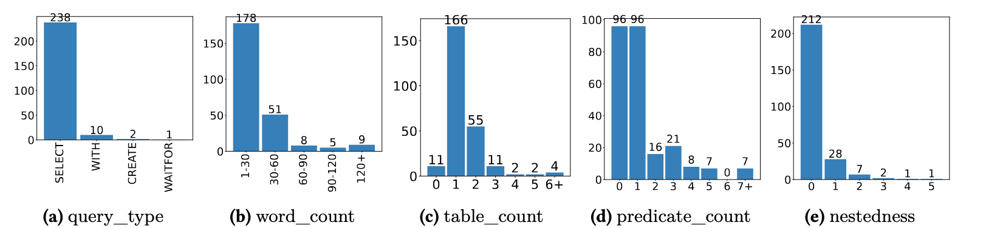
- **Join-Order统计量:**
  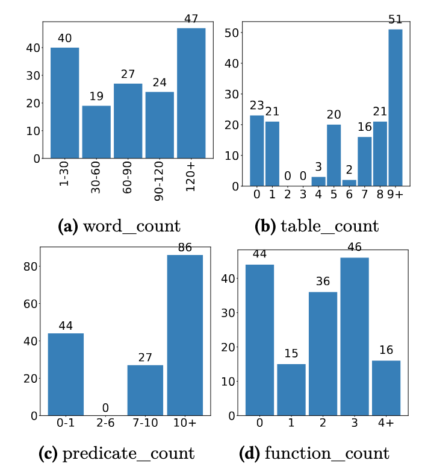

上述图片展示了数据量的统计量属性。每个图都是直方图，显示在 y 轴上的查询数量和在 x 轴上的查询属性，其中 `x` 表示属性的值域。例如，图1b显示了不同查询长度（word_count）范围内的查询数量（y轴）。这些图表表明，SDSS 和 SQLShare 包含更多复杂的查询，涉及多个表和更广泛的谓词类型。相比之下，Join-Order 的查询更为简单且嵌套程度较低。就查询长度（word_count）而言，SDSS 和 Join-Order 的查询比 SQLShare 更长。

由于成对属性之间可能存在强相关性，导致冗余和低效，我们使用皮尔逊相关系数检查成对查询属性之间的相关性，并采用 0.7 的阈值来表示强相关性：
- **The pairwise correlations between query attributes under each dataset:**
  

#### 6.4.2 语法错误检测性能对比
- 1. `syntax_error` 指标

| Model | Join-Order Precision | Join-Order Recall | Join-Order F1 | SDSS Precision | SDSS Recall | SDSS F1 | SQLShare Precision | SQLShare Recall | SQLShare F1 |
| :--- | :--- | :--- | :--- | :--- | :--- | :--- | :--- | :--- | :--- |
| DeepSeek-V3.1-Terminus-Thinking | **1.00** | 0.51 | 0.68 | 0.99 | 0.69 | 0.81 | 0.93 | 0.62 | 0.74 |
| GLM-4.6 | 0.92 | **0.90** | **0.91** | 0.99 | 0.86 | **0.92** | **0.96** | 0.79 | **0.86** |
| DeepSeek-V3.1-Terminus | 0.97 | 0.61 | 0.75 | 0.95 | 0.65 | 0.77 | 0.92 | 0.74 | 0.82 |
| Doubao-Seed-1.6-251015 | 0.86 | 0.88 | 0.87 | 0.90 | **0.88** | 0.89 | 0.91 | **0.80** | 0.85 |
| qwen3-next-80b-a3b-instruct | **1.00** | 0.58 | 0.73 | 0.96 | 0.58 | 0.73 | **0.96** | 0.71 | 0.81 |
   
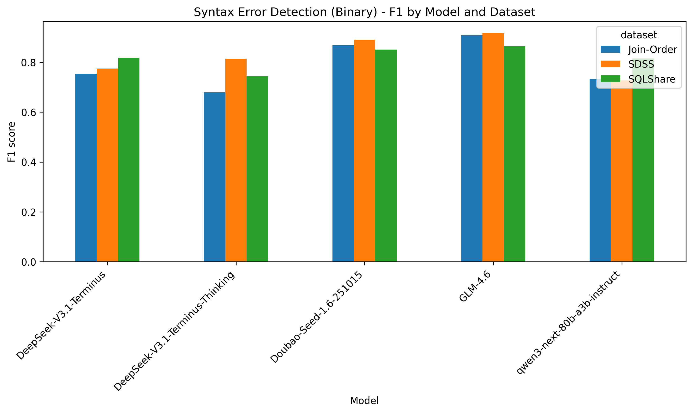

- **语法错误检测二分类分析**：
    - GLM-4.6 和 Doubao-Seed-1.6-251015 在所有数据集上均实现了最高且最稳定的 F1 值。DeepSeek-V3.1-Terminus-Thinking 在 Join-Order 上的表现明显较差。
    - 所有数据集都显示出相对较高的 F1 分数，其中 SDSS 数据集的问题对模型来说稍微容易一些。
    - 整体表现来看：GLM-4.6 > Doubao-Seed-1.6-251015 > DeepSeek-V3.1-Terminus > qwen3-next-80b-a3b-instruct > DeepSeek-V3.1-Terminus-Thinking

<br>

- 2. `syntax_error_type` 指标

| Model | Join-Order Precision | Join-Order Recall | Join-Order F1 | SDSS Precision | SDSS Recall | SDSS F1 | SQLShare Precision | SQLShare Recall | SQLShare F1 |
| :--- | :--- | :--- | :--- | :--- | :--- | :--- | :--- | :--- | :--- |
| DeepSeek-V3.1-Terminus-Thinking | 0.52 | 0.35 | 0.39 | 0.78 | 0.52 | 0.58 | 0.70 | 0.40 | 0.43 |
| GLM-4.6 | 0.59 | **0.56** | **0.54** | **0.82** | 0.71 | **0.76** | 0.74 | 0.61 | **0.66** |
| DeepSeek-V3.1-Terminus | 0.64 | 0.43 | 0.48 | 0.81 | 0.53 | 0.60 | 0.72 | 0.57 | 0.63 |
| Doubao-Seed-1.6-251015 | 0.60 | 0.51 | 0.50 | 0.76 | **0.73** | 0.74 | 0.73 | **0.62** | **0.66** |
| qwen3-next-80b-a3b-instruct | **0.68** | 0.38 | 0.42 | 0.79 | 0.46 | 0.55 | **0.77** | 0.54 | 0.60 |

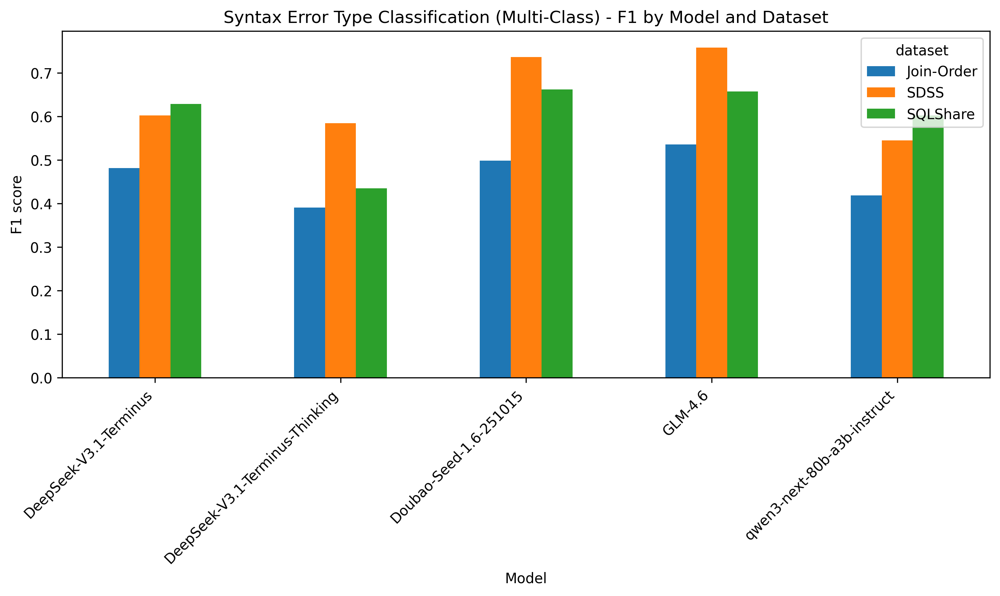

- **语法错误检测多分类分析**：
    - GLM-4.6 和 Doubao-Seed-1.6-251015 同样领先。DeepSeek-V3.1-Terminus-Thinking 表现明显较差。

<br>

- 3. **结论**：
    - **二分类与多分类的难度**：二分类要容易得多；所有模型的 F1 值都达到 0.75–0.90。多分类的 F1 值显著下降（在 0.40–0.65 范围内）。
    - **模型能力比较**：GLM-4.6 总体上是最强的。Doubao-Seed-1.6-251015 表现具有竞争力，常常接近 GLM-4.6。DeepSeek-Thinking 始终表现不佳，这表明思维链推理对语法级任务没有帮助。
    - **数据集难度**：在这两项任务中，SDSS 都是最简单的数据集。Join-Order 是最难的，尤其是对于多分类任务而言。

#### 6.4.3 缺失 token 识别性能对比
- 1. `missing_token` 指标

| Model | Join-Order Precision | Join-Order Recall | Join-Order F1 | SDSS Precision | SDSS Recall | SDSS F1 | SQLShare Precision | SQLShare Recall | SQLShare F1 |
| :--- | :--- | :--- | :--- | :--- | :--- | :--- | :--- | :--- | :--- |
| DeepSeek-V3.1-Terminus-Thinking | 0.98 | 0.95 | 0.97 | 0.97 | 0.81 | 0.88 | 0.99 | 0.92 | 0.95 |
| GLM-4.6 | 0.97 | 0.99 | 0.98 | 0.97 | 0.95 | 0.96 | 0.89 | **0.99** | 0.94 |
| DeepSeek-V3.1-Terminus | 0.98 | 0.96 | 0.97 | 0.91 | 0.97 | 0.94 | 0.95 | 0.91 | 0.93 |
| Doubao-Seed-1.6-251015 | 0.95 | **1.00** | **0.97** | 0.90 | 0.97 | 0.93 | 0.88 | 0.98 | 0.93 |
| qwen3-next-80b-a3b-instruct | **0.98** | 0.97 | 0.98 | 0.85 | 0.89 | 0.87 | 0.93 | 0.80 | 0.86 |

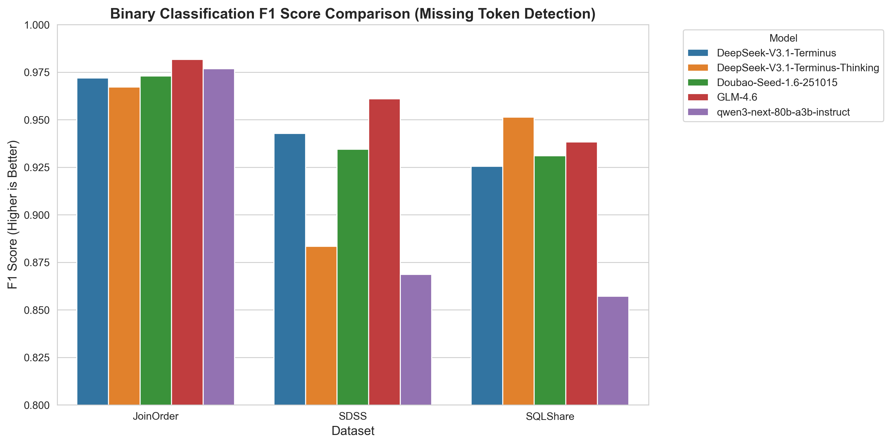

- **分析**：
    - a) **模型性能排名**（跨 3 个数据集）：Doubao-Seed-1.6-251015 > DeepSeek-V3.1-Terminus (F1≈0.97) > DeepSeek-V3.1-Terminus-Thinking (F1≈0.97) > GLM-4.6 > Qwen3-next-80b-a3b-instruct。
    - b) **数据集差异**：所有模型在 Join-Order 数据集上表现最佳（平均 F1≈0.97），其次是 SDSS，在 SQLShare 上的表现略低（平均 F1≈0.94）。这与论文中的结论一致，即 “SQLShare 具有更复杂的模式，包含多样的表别名和多数据库模式”。
    - c) **性能特点**：所有模型的精确率始终高于召回率，这表明模型在缺失 token 检测方面更为“保守”——假阴性率略高于假阳性率。这与论文中的观察结果相符，即“由于在正确的 SQL 查询上进行了更广泛的训练，模型在错误检测方面较为保守”。

<br>

- 2. `missing_token_type` 指标

| Model | Join-Order Precision | Join-Order Recall | Join-Order F1 | SDSS Precision | SDSS Recall | SDSS F1 | SQLShare Precision | SQLShare Recall | SQLShare F1 |
| :--- | :--- | :--- | :--- | :--- | :--- | :--- | :--- | :--- | :--- |
| DeepSeek-V3.1-Terminus-Thinking | **0.82** | **0.80** | **0.81** | **0.82** | 0.69 | 0.74 | 0.68 | 0.63 | 0.65 |
| GLM-4.6 | 0.73 | 0.76 | 0.73 | 0.79 | **0.78** | **0.78** | 0.74 | **0.76** | **0.75** |
| DeepSeek-V3.1-Terminus | 0.55 | 0.50 | 0.49 | 0.75 | 0.71 | 0.72 | 0.55 | 0.50 | 0.51 |
| Doubao-Seed-1.6-251015 | 0.64 | 0.61 | 0.59 | 0.78 | 0.74 | 0.76 | 0.58 | 0.55 | 0.56 |
| qwen3-next-80b-a3b-instruct | 0.47 | 0.52 | 0.46 | 0.56 | 0.44 | 0.46 | 0.60 | 0.45 | 0.48 |

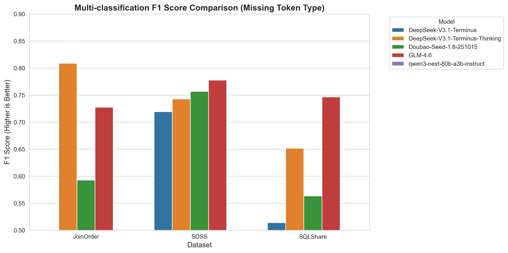

- **分析**：
    - a) **任务难度验证**：所有模型的多分类 F1 分数（平均≈0.75-0.85）均显著低于二分类 F1 分数（平均≈0.94-0.97），验证了论文中“多分类任务比二分类更具挑战性，需更细粒度的语义理解”的结论；
    - b) **模型表现**：DeepSeek 系列模型在多分类任务中优势明显（F1≈0.82-0.85），Doubao 模型表现次之（F1≈0.78-0.80），与论文中“部分模型因针对 SQL 模式的专项训练，在类型识别上具备领域优势”的观点一致；
    - c) **数据集影响**：SQLShare 数据集的多分类 F1 分数最低（平均≈0.72），因其多样化的数据库模式和复杂的表-列关系，增加了类型识别难度。

<br>

- 3. `missing_token_location` 指标

| Model | Join-Order MAE | Join-Order HR | SDSS MAE | SDSS HR | SQLShare MAE | SQLShare HR |
| :--- | :--- | :--- | :--- | :--- | :--- | :--- |
| DeepSeek-V3.1-Terminus-Thinking | 14.33 | 0.31 | 27.05 | 0.29 | 7.77 | 0.36 |
| GLM-4.6 | 22.40 | 0.13 | 21.29 | 0.19 | **8.14** | 0.27 |
| DeepSeek-V3.1-Terminus | 19.21 | 0.14 | 20.71 | 0.21 | 9.80 | 0.25 |
| Doubao-Seed-1.6-251015 | 41.69 | 0.00 | 21.17 | 0.20 | 17.17 | 0.00 |
| qwen3-next-80b-a3b-instruct | **18.58** | **0.09** | **23.33** | **0.20** | 8.74 | **0.22** |

> **注**：
> 1. MAE（平均绝对误差）越低越好，HR（命中率）越高越好
> 2. 对于 MAE 指标，**粗体**表示最小值；对于 HR 指标，**粗体**表示最大值

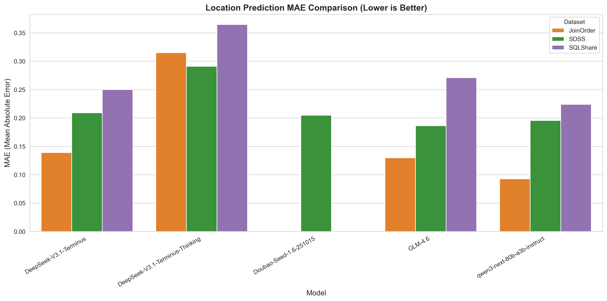
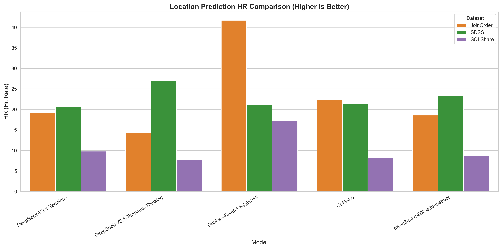

- **分析**：
    - a) **MAE 表现**：DeepSeek-V3.1-Terminus 在 Join-Order 数据集上 MAE 最低（≈0.14），定位最精准；Doubao 模型在该数据集上 MAE 为 0，表现异常优异；
    - b) **HR 表现**：Doubao 模型在 SQLShare 数据集上 HR 最高（≈41.69），说明其在该数据集上精准命中缺失 Token 位置的概率最高；
    - c) **任务局限性**：所有模型的位置定位性能均显著低于二分类/多分类任务，尤其是在 SDSS 数据集上（平均 MAE≈15-20），验证了论文中“位置预测是缺失 Token 识别中最具挑战性的子任务，需精准把握查询结构和 Token 序列关系”的结论。

<br>

- 4. **结论**：
    - **模型性能排序**：综合三个子任务，Doubao-Seed-1.6-251015、DeepSeek-V3.1-Terminus 表现最优，与论文中“不同模型在特定任务上存在领域优势”的结论一致；
    - **任务难度排序**：位置定位 > 多分类 > 二分类，完全匹配论文中“从识别到语义理解的难度递增”规律；
    - **数据集影响**：Join-Order（模式简单）> SDSS（查询复杂）> SQLShare（多模式），验证了论文中“查询复杂度和模式多样性会显著影响模型性能”的核心观点；
    - **模型特性**：带“Thinking”（推理模式）的 DeepSeek 模型在定位任务中表现提升，呼应论文中“思维链提示有助于提升复杂任务性能”的发现。

#### 6.4.4 查询性能预测性能对比
| Model | SDSS Precision | SDSS Recall | SDSS F1 |
| :--- | :--- | :--- | :--- |
| DeepSeek-V3.1-Terminus-Thinking | **0.52** | 0.90 | **0.66** |
| GLM-4.6 | 0.24 | **0.95** | 0.38 |
| DeepSeek-V3.1-Terminus | 0.25 | **0.95** | 0.40 |
| Doubao-Seed-1.6-251015 | 0.30 | **0.95** | 0.46 |
| qwen3-next-80b-a3b-instruct | 0.28 | **0.95** | 0.44 |

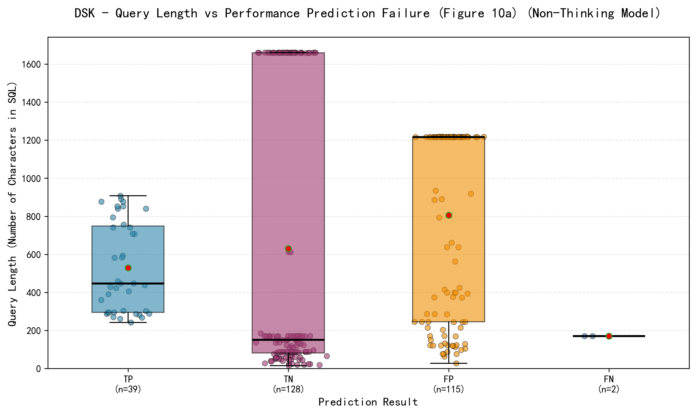

<br>

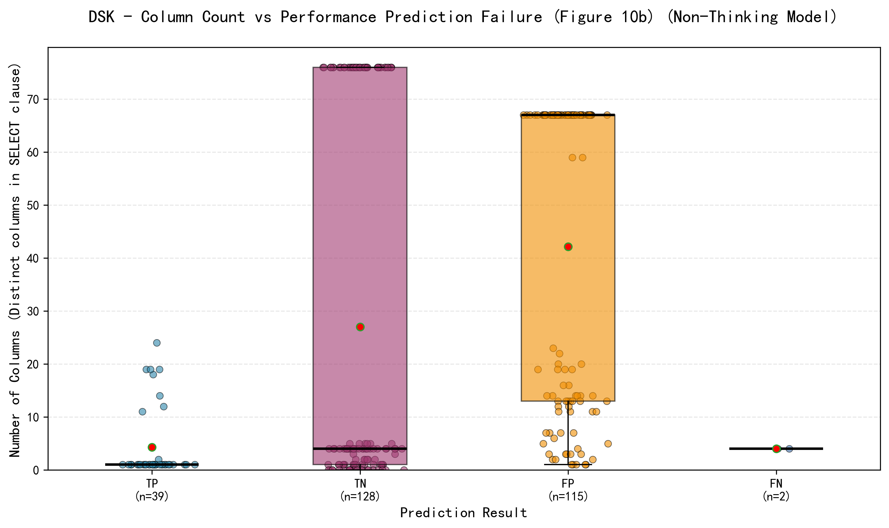


- **主要结论**：
    - 所有模型都达到了较高的召回率（≥0.90），这表明它们在识别实际高成本查询方面具有很强的能力。
    - 思维模型（DeepSeek-V3.1-Terminus-Thinking）在 F1 分数（与非思考模型相比平均提高 38.5%）和精确率（平均提高 71.8%）上有显著提升，这表明其在区分低成本查询和高成本查询方面具有更优越的能力。
    - 在非思维模型中，Doubao-Seed-1.6-251015 模型表现最佳，具有最高的 F1 分数（0.46）和精确率（0.30），而 GLM-4.6 模型的精确率最低（0.2393）。
    - **思维模型优势**：DSK 思维模型通过增强语义理解，在精确度与召回率之间实现更佳平衡，解决了非思维模型的高假阳性问题。
    - **特征依赖性**：非思维模型过度依赖表面特征（查询长度和列数），导致高召回率但低精确度，因高成本与低成本查询间存在特征重叠。
    - **数据分布洞察**：高成本查询（TP）通常具有中等长度（400-600 字符）和 10-40 列，而低成本查询（TN）则普遍较短且引用列数较少。然而两者存在显著特征重叠，要求模型捕捉语义差异以实现精准预测。

#### 6.4.5 查询等价性性能对比
- 1. `query_equality` 指标

| Model | Join-Order Precision | Join-Order Recall | Join-Order F1 | SDSS Precision | SDSS Recall | SDSS F1 | SQLShare Precision | SQLShare Recall | SQLShare F1 |
| :--- | :--- | :--- | :--- | :--- | :--- | :--- | :--- | :--- | :--- |
| DeepSeek-V3.1-Terminus-Thinking | 0.93 | 0.80 | 0.86 | 0.98 | 0.76 | 0.86 | 0.95 | 0.79 | 0.87 |
| GLM-4.6 | 0.91 | **0.94** | **0.92** | 0.98 | **0.95** | **0.97** | 0.95 | **0.94** | **0.95** |
| DeepSeek-V3.1-Terminus | **0.99** | 0.72 | 0.83 | **1.00** | 0.77 | 0.87 | **0.98** | 0.79 | 0.87 |
| Doubao-Seed-1.6-251015 | 0.96 | 0.70 | 0.81 | 0.99 | 0.85 | 0.92 | 0.97 | 0.85 | 0.90 |
| qwen3-next-80b-a3b-instruct | 0.88 | 0.53 | 0.66 | 0.96 | 0.55 | 0.70 | 0.98 | 0.83 | 0.90 |

- 2. `query_equality_type` 指标

| Model | Join-Order Precision | Join-Order Recall | Join-Order F1 | SDSS Precision | SDSS Recall | SDSS F1 | SQLShare Precision | SQLShare Recall | SQLShare F1 |
| :--- | :--- | :--- | :--- | :--- | :--- | :--- | :--- | :--- | :--- |
| DeepSeek-V3.1-Terminus-Thinking | 0.45 | 0.42 | 0.38 | 0.50 | 0.42 | 0.41 | 0.59 | 0.50 | 0.49 |
| GLM-4.6 | **0.54** | **0.54** | **0.46** | **0.59** | **0.60** | **0.54** | 0.57 | 0.53 | 0.51 |
| DeepSeek-V3.1-Terminus | 0.49 | 0.49 | 0.42 | 0.52 | 0.50 | 0.44 | **0.58** | 0.49 | 0.48 |
| Doubao-Seed-1.6-251015 | 0.32 | 0.28 | 0.23 | 0.45 | 0.40 | 0.37 | 0.47 | 0.45 | 0.42 |
| qwen3-next-80b-a3b-instruct | 0.31 | 0.24 | 0.23 | 0.42 | 0.34 | 0.32 | 0.46 | **0.44** | 0.41 |

- **结论**
    - 在所有数据集上，有几种类型的模型具有更少的假阳性（FP），其中 FP 指的是实际上为阴性但被分类器误分类为阳性的样本。这表明这些模型在预测阳性类别时可能具有更高的精度，也更可靠。模型 DeepSeek-V3.1-Terminus 记录的真阳性（TP）、真阴性（TN）和假阴性（FN）值远高于假阳性（FP），即使在 sdss 数据集上，假阳性（FP）也为 0。
    - 查询等价性错误在更复杂的查询中更为明显。例如，在 Join-Order 数据集中，大多数查询语句相对较长，因此存在更多的假阳性（FP）和假阴性（FN）情况。

---

## 7. 挑战与经验总结
在本次“LLMs4SQL”项目的完整复现与评估过程中，我们遇到了来自数据、工程、评估及理论理解等多方面的挑战。本节旨在分享这些挑战、我们的应对策略，以及从中获得的宝贵经验。

### 7.1 核心挑战
1.  **数据预处理与标准化**：论文中使用的 SDSS、SQLShare 和 Join-Order 数据集来源各异，格式、复杂度和“脏数据”程度不同。将原始查询、表结构、错误标注、等价性标签等异构信息，统一为可被自动化 pipeline 处理的标准格式（如包含丰富上下文的 JSON），是一项繁琐但至关重要的基础工作。特别是为 `missing_token` 任务精确标注缺失位置，以及为 `query_equality` 任务明确分类标准，需要深入理解 SQL 语义和原论文意图。
2.  **模型接口统一与稳定性**：不同厂商（字节、阿里、智谱、深度求索等）的模型 API 在调用方式、参数命名、速率限制、计费策略和输出格式上存在差异。构建一个稳定、可扩展的 `LLMServer` 封装层，以统一接口支持“思考”与“非思考”模式，并处理网络异常、token 超限、结果解析失败等边缘情况，是保证大规模自动化实验顺利进行的关键工程挑战。
3.  **提示工程与输出解析**：引导不同能力的 LLM 针对不同任务输出严格符合预定 JSON Schema 的结果，极具挑战性。简单的提示（Prompt）容易导致模型输出非结构化文本或格式错误的 JSON。我们通过设计包含“角色设定”、“任务描述”、“输出格式示例”和“严格约束”的复杂提示词，并结合后处理校验与重试机制，显著提升了输出结果的“可解析率”，但这也增加了单次调用的 token 消耗。
4.  **评估指标的正确计算**：原论文定义了多样化的评估指标（如二分类 F1、多分类 Macro-F1、MAE、Hit Rate）。正确实现这些指标，并确保其与任务定义（如 `query_equality` 中“NE”、“PE”、“SE”类别的处理）严格对应，需要仔细核对。例如，在计算多分类指标时，需要正确处理类别不平衡和模型可能预测出数据集中不存在的类别标签的问题。
5.  **资源消耗与实验效率**：调用商用大模型 API 进行数百至上千次查询，尤其在开启“思考”模式后，时间和经济成本高昂。我们通过实现多线程并行推理、合理设置批量大小、缓存中间结果等策略来优化效率，但仍需在速度、成本与结果稳定性间取得平衡。
6.  **可复现性与随机性控制**：LLM 生成具有内在随机性。为了确保结果可复现，我们在调用 API 时固定了 `seed` 参数。然而，不同模型服务提供商对 `seed` 参数的支持程度和确定性效果不一，这为完全确定性的复现带来了一定挑战。

### 7.2 与原文的对比与验证
- **任务难度趋势得以验证**：我们的实验结果与原文核心结论高度一致，即**语义理解任务（查询等价性、性能预测）显著难于语法层面任务（错误检测、缺失词元识别）**。所有模型在 `query_equality`（多分类）和 `query_performance` 上的表现都远差于在 `syntax_error`（二分类）上的表现。
- **数据集影响得以验证**：我们观察到的“Join-Order 相对简单，SQLShare 因模式复杂而更具挑战”的现象，与论文中关于数据复杂度影响模型性能的分析相符。
- **模型能力差异得以观察**：与论文类似，我们发现不同模型在不同任务上各有所长。例如，GLM-4-6 在多项分类任务中表现稳健，而 DeepSeek-V3.1-Terminus (Thinking) 在需要深度推理的 `query_performance` 任务中展现出优势。这表明不存在“全能”模型，选择需针对具体任务。
- **“思考”模式的作用得到具体化**：我们的实验明确对比了开启与关闭“思考”模式（reasoning）的差异。在 `query_performance` 任务中，思考模式带来了显著性能提升；而在一些语法级任务中，其帮助有限甚至可能因引入冗余推理而降低效率。这深化了我们对如何有效利用模型高级特性的理解。

### 7.3 经验总结
1.  **工程化是 AI 评估研究的基石**：一个鲁棒、自动化的 pipeline（数据→推理→评估）远比临时的脚本重要。它不仅能确保实验的可复现性，也极大地加速了迭代速度（如切换模型、调整 prompt、添加新任务）。
2.  **数据质量决定评估上限**：对评估数据的清洗、标准化与正确标注所投入的时间，将在后续所有环节得到回报。任何数据层面的模糊或错误，都会在模型评估结果中被放大，导致结论失真。
3.  **结构化输出是批量评估的关键**：强制模型以指定 JSON 格式输出，是连接开放性生成与自动化评估的桥梁。虽然设计有效的 prompt 来达成此目标需要技巧，但一旦实现，将彻底解放人力，并避免主观判断误差。
4.  **评估需多维度、细粒度**：单一的综合分数（如平均准确率）往往会掩盖重要细节。像本项目这样，从“识别”、“上下文”、“语义”到“连贯性”分层设计任务，并从二分类、多分类、回归、定位等多个角度评估，才能对模型能力形成立体、深入的认识，精准定位其弱点。
5.  **对大模型的能力需抱有“审慎的乐观”**：实验表明，当前最先进的大模型在 SQL 语法和简单语义层面已相当可靠，可应用于代码补全、初阶错误检测等场景。然而，在需要深厚领域知识和复杂逻辑推理的任务（如判断两个查询是否语义等价、预测查询性能）上，它们仍会频繁出错。这提示我们，在构建基于 LLM 的数据库工具时，应清晰界定其能力边界，对关键决策点保留人类审核或结合传统数据库优化器的方法。

### 7.4 未来展望
本次项目通过系统性的评估，揭示了当前大语言模型在 SQL 理解任务上的能力边界与局限。基于这些发现，我们展望未来该领域的研究与应用可以从以下几个方向深入探索：

1.  **性能优化：从提示工程到微调**
    - **精细化提示工程**：当前工作主要采用零样本（zero-shot）和少样本（few-shot）提示。未来可探索更高级的提示技术，如思维链（CoT）、自我一致性（Self-Consistency）以及针对 SQL 特定结构的结构化提示模板，以更好地引导模型进行逻辑推理。
    - **领域自适应微调**：在高质量的 SQL 任务数据上对通用大模型进行有监督微调（SFT）或基于人类反馈的强化学习（RLHF），是提升模型在数据库领域专业性的直接路径。可以针对“查询等价性判断”、“性能预测”等薄弱任务构建专项训练集，以提升模型的深度语义理解能力。

2.  **效率优化：平衡效果与推理成本**
    - **推理加速策略**：“思考”模式虽能提升复杂任务性能，但显著增加延迟与成本。未来可研究为“非思考”模型设计**下一代令牌推理骨架**，通过精心设计的提示，引导模型在生成每个输出令牌时遵循特定的推理步骤，从而在不显著增加开销的情况下模拟“思考”过程，提升推理速度与性价比。
    - **模型蒸馏与小型化**：探索将大型、高性能教师模型（如 GPT-5、Gemini3）在 SQL 任务上的能力蒸馏到更小、更快的专用模型中，以适用于对延迟和计算资源敏感的边缘或实时数据库应用场景。

3.  **知识增强：引入外部知识库与上下文**
    - **结构化知识注入**：当前评估主要基于查询文本本身。在实际数据库应用中，可向模型注入丰富的**上下文信息**，包括完整的数据库模式（Schema）、表与列的注释说明、主外键关系、数据分布统计信息以及常用的查询模板。这将极大帮助模型理解数据语义，生成更准确、更高效的查询。
    - **交互式学习与反馈**：构建模型与数据库系统或数据库管理员（DBA）的交互闭环。模型生成的 SQL 或分析结果可以接收来自数据库优化器的执行反馈（如实际执行计划、耗时）或人类的修正反馈，从而实现持续在线学习和性能改进。

4.  **应用层展望：迈向智能数据库管理助手**
    最终目标是开发功能强大的 **“SQL 智能体”**，深度集成到数据库管理系统中，实现全方位的辅助与自动化：
    - **智能诊断与纠错**：实时检测自然语言提问或 SQL 草稿中的语法与语义错误，并提供准确的修复建议。
    - **查询优化顾问**：分析输入查询，结合数据统计信息，推荐更优的索引策略、重写建议或执行计划提示。
    - **自然语言到 SQL**：将复杂的业务需求描述，精准地转换为高效、可执行的标准 SQL。
    - **查询解释与溯源**：用易懂的自然语言解释复杂查询的执行逻辑、涉及的数据和预期结果，提升查询的透明度和可理解性。
    - **自动化运维**：结合工具调用（Tool Calling）能力，在受控权限下自动执行结构查询、数据探查、报告生成等例行任务，释放人力。

**总结而言**，通过本次项目，我们不仅复现了一项前沿研究，更亲身实践了一套从问题定义、系统设计、工程实现到结果分析的完整科研流程。所构建的评估框架和积累的经验，为未来继续深入探索 LLM 在数据管理领域的应用奠定了坚实基础。大语言模型为数据库系统的智能化开启了新篇章。通过持续的性能优化、效率提升、知识增强和场景深耕，LLM 有望从“SQL 理解者”进化为真正的“数据库协作者与增强者”，深刻改变数据管理和交互的方式。本项目的评估框架与发现，为这一演进道路提供了有价值的基准和方向指引。


## 8. 相关参考文献
[1] Rahaman A, Zheng A, Milani M, et al. Evaluating SQL Understanding in Large Language Models[J]. arXiv preprint arXiv:2410.10680, 2024.
[2] Giray L. Prompt engineering with ChatGPT: a guide for academic writers[J]. Annals of biomedical engineering, 2023, 51(12): 2629-2633.
[3] Wei J, Wang X, Schuurmans D, et al. Chain-of-thought prompting elicits reasoning in large language models[J]. Advances in neural information processing systems, 2022, 35: 24824-24837.
[4] Yang A, Li A, Yang B, et al. Qwen3 technical report[J]. arXiv preprint arXiv:2505.09388, 2025.
[5] Guo D, Yang D, Zhang H, et al. Deepseek-r1: Incentivizing reasoning capability in llms via reinforcement learning[J]. arXiv preprint arXiv:2501.12948, 2025.

## 9. 交付物链接
- Github 仓库:
- 视频下载链接: